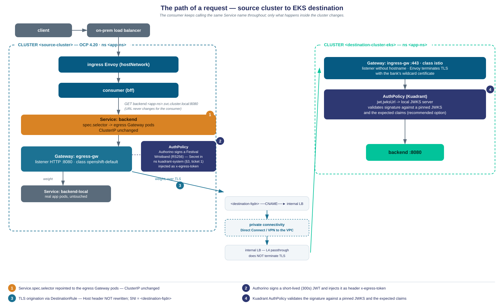

# Secure Cross-Cluster Egress with Kuadrant / RHCL — Architecture, Results, and Open Questions

**Prepared for:** Red Hat LATAM — Connectivity Link (Kuadrant) product/BU

**Prepared by:** Banco Galicia — Platform Engineering

**Date:** 2026-08-12

**Context:** Follow-up to Red Hat's request for the design document and the limitations found with Authorino during our egress PoC, so the product BU can weigh in with authoritative answers.

---

## How to read this document

We closed a PoC that moves a backend service to a second cluster (Amazon EKS) without any change to its consumer, using an RHCL/Kuadrant **egress gateway pattern** to sign and inject a short-lived credential on the outbound hop, and Kuadrant (upstream, on the EKS side — see §1.3) to validate it on ingress. The mechanics are proven: 37 automated scenario checks pass, and we have real latency/throughput numbers measured against the actual EKS destination.

While building and validating it we ran into a number of things that did not behave the way the documentation led us to expect. Section 3 is the core of this document: each item is written as a ticket — what we expected, what happened (with literal evidence), how we worked around it, and one concrete question we need the BU to answer. Section 4 has minimal, reproducible manifests for each one.

**Placeholders used throughout** (real values are internal identifiers of our environment and are not included):

| Placeholder | Stands for |
|---|---|
| `<source-cluster>` | OpenShift cluster where the consumer and the egress gateway run |
| `<destination-cluster-eks>` | Amazon EKS cluster hosting the migrated backend (primary destination discussed here) |
| `<destination-cluster-ocp>` | A second OpenShift cluster we also validated the same pattern against, as a portability check (§1.3) |
| `<source-app-fqdn>` | Public-facing FQDN the original consumer calls |
| `<destination-fqdn>` | FQDN the egress gateway opens TLS to, CNAME'd to the destination cluster's load balancer |
| `<issuer-fqdn>` | Value used as the `iss` claim of the signed token |
| `<ingress-node-ip-N>` | IP address of an on-prem ingress node |
| `<nlb-internal-ip>` | Internal IP of the destination cluster's load balancer |

Kubernetes object names, CRD field names, header names, and claim names are kept **verbatim** — they are needed to reproduce the findings and are not sensitive. No key material (private or public) appears anywhere in this document, including the appendix.

---

## 1. Use case and architecture

**A scoping note before the design.** This PoC does not evaluate a full service-mesh rollout across clusters, and that is a deliberate position, not a gap we intend to close later. Our working stance is that east-west traffic — including hops that cross cloud boundaries, as this one does — should be treated, authenticated, and policy-enforced as if it were north-south traffic at a gateway boundary, rather than carried over a flat mesh trust domain spanning both clusters. The egress-gateway pattern described below is a direct expression of that stance: the source cluster's egress `Gateway` and the destination cluster's ingress `Gateway` are the only two points where cross-cluster traffic is inspected, authenticated, and policed, with no mesh-level trust extended between the two sides. We mention this up front because some of what follows (§3, ticket 4 in particular) touches Gateway API and Istio-adjacent components, and we want to be clear that adopting those doesn't imply we're evaluating a cross-cluster mesh.

### 1.1 Problem statement

A consumer (`bff`) calls a backend through a Kubernetes `Service` DNS name:
`http://backend.<namespace>.svc.cluster.local:8080`. We need to move that backend to a different cluster with three constraints:

1. **No change to the consumer** — same host, same IP, same port, no redeploy.
2. **The cross-cluster hop must be authenticated**, without relying on a shared IdP or on permanent network connectivity between the two clusters (this is a hybrid on-prem/cloud environment; connectivity to the cloud side can't be assumed to always be up).
3. **Progressive, reversible migration** — no big-bang cutover with a maintenance window.

### 1.2 Design

Three pieces, modeled directly on Kuadrant's [egress gateway for AI workloads](https://kuadrant.io/blog/egress-gateway-ai-workloads/) pattern (credential injection on an outbound hop via an egress gateway):

1. **Interception by `Service` selector.** The backend's `Service` is not recreated: its `spec.selector` is patched so its endpoints become the pods of a dedicated egress `Gateway` instead of the application pods. Same ClusterIP, same name, same port — the consumer's DNS resolution and connection behavior are completely unaffected. Rollback is the same patch in reverse, ~1 second, no cold start.
2. **Signing on the way out.** That egress `Gateway`, through a Kuadrant `AuthPolicy`, has Authorino issue a short-lived (300 s) JWT — a Festival Wristband — and inject it into a custom header (`x-egress-token`, not `Authorization`, so it doesn't collide with any business credential already on the request). The client authenticates to the egress gateway as `anonymous`; who is allowed to reach the gateway at all is controlled by `NetworkPolicy` today (see §3, ticket 3, for the production hardening path).
3. **Weighted traffic split.** Once the `Service` is intercepted, all local/remote traffic distribution is controlled from the `HTTPRoute`: mirror → header-based canary → weighted 1/5/25/50/100%. The `Service` itself is never touched again after the initial cutover.



*Numbered callouts above map to the three design pieces and the destination-side validation: (1) Service selector interception, (2) Authorino signing the wristband, (3) TLS origination toward the destination, (4) Kuadrant validating the token at the destination.*

The Host header the consumer originally used is **never rewritten** — the destination routes on it, and the SNI presented to the destination's load balancer is set independently by the `DestinationRule`. This was a deliberate design choice (Gateway API doesn't support per-`backendRef` filters when a rule has more than one backend — [istio#39136](https://github.com/istio/istio/issues/39136) — so a Host rewrite would have applied to both the local and remote backend of the same rule) and it holds up against the real destination (§2.1, item 3).

### 1.3 Component versions

| Component | Version | Notes |
|---|---|---|
| OpenShift Container Platform | 4.20.x | Both `<source-cluster>` (IPI vSphere) and `<destination-cluster-ocp>` (separate site) |
| Red Hat Connectivity Link (RHCL) | **1.3.0**, channel `stable` | Installed via OperatorHub, `installPlanApproval: Manual` |
| Gateway API | v1 (GA) | Via OCP's built-in `openshift-default` `GatewayClass` (controller `openshift.io/gateway-controller/v1`) |
| Kuadrant Operator / Authorino / Limitador | *Not individually pinned in our evidence* | Whatever RHCL 1.3.0 packages. We could not find where to read the exact upstream versions RHCL 1.3.0 ships — see §3, ticket 2, for why this matters for one specific finding |
| Destination: `<destination-cluster-eks>` | Amazon EKS | Istio + Gateway API (`gatewayClassName: istio`), AWS Load Balancer Controller |
| Kuadrant on the EKS side | **Upstream** (not RHCL) | RHCL for EKS is not GA yet (targeted 2027 per Red Hat's own roadmap communication to us). This is a deliberate, documented exception in our internal architecture decision record for using Kuadrant as our API-gateway L7 policy layer: we accept upstream Kuadrant on EKS only, pinned to an explicit version, with our own CVE watch, until RHCL/EKS ships — at which point we've committed to migrate. Happy to share the ADR text if useful context for the BU's roadmap conversation. |
| Service mesh (destination-ocp portability variant) | OSSM (Sail operator) 3.4.0, Istio v1.30.1 | Used on `<destination-cluster-ocp>`, and also on the manually-deployed ingress `Gateway` referenced in §3, ticket 4 |

We also validated the identical pattern (no origin-side changes at all) against `<destination-cluster-ocp>`, a second on-prem OpenShift cluster, published through the HAProxy router with a `passthrough` `Route`. It exists purely as a portability check and isn't the focus of this document, except where noted in ticket 4 (it hits the same `openshift-default` `GatewayClass` behavior).

### 1.4 Key design decisions

| Decision | Why |
|---|---|
| Dedicated egress `Gateway`, in the consumer's namespace | `Service` selectors are namespace-scoped, so the egress `Gateway`'s pods must live in the same namespace as the intercepted `Service`. (This does **not** mean the signing key lives there too — see §3, ticket 1.) |
| Interception via `Service.spec.selector` patch, not recreation | One-field patch, ClusterIP never changes, no DNS layer involved, the application `Deployment` is never touched. Rollback is the same patch reversed. |
| `ServiceEntry` port declared as `protocol: HTTP`, TLS added by `DestinationRule` | Standard TLS-origination-at-egress-gateway pattern: Envoy needs to route at L7 to inject the header; a raw `HTTPS` `ServiceEntry` would be opaque TCP and injection wouldn't be possible. |
| No `URLRewrite` of the Host header | Filters at `backendRef` granularity aren't supported when a rule has more than one backend ([istio#39136](https://github.com/istio/istio/issues/39136)); the SNI is set independently via `DestinationRule`, so routing at the destination and the certificate presented are unaffected. |
| Custom header `x-egress-token`, not `Authorization` | The wristband is injected raw, without a `Bearer` prefix, so it can coexist with any business credential already on the request. |
| `authentication: anonymous` on the egress `AuthPolicy` | The consumer sends no credentials and is not modified. Access to the egress gateway itself is controlled by `NetworkPolicy`. See §3, ticket 3, for the production-hardening gap this leaves open. |
| Validate on Kuadrant (`AuthPolicy`) at the EKS destination, not Istio `RequestAuthentication` | Keeps one policy plane (`AuthPolicy`) on both sides and gives a direct convergence path once RHCL/EKS ships, at the cost of the upstream-Kuadrant exception above. The Istio-only alternative is documented and kept as a lower-footprint fallback — see Appendix, item A. |
| Pinned JWKS at the destination (ConfigMap-served for Kuadrant, inline for the Istio fallback) | Zero network dependency of the destination back toward the source cluster. |
| `tokenDuration: 300` | Short replay window without a latency penalty — Authorino signs per-request, no external round trip. |

---

## 2. What worked

### 2.1 Validated mechanics (`<source-cluster>` only, before the destination was reachable)

An automated suite of 37 scenario checks (`run-escenarios.sh`), last green run 2026-08-05:

| Scenario | What it proves | Result |
|---|---|---|
| E0 — Environment | Starting state matches PoC assumptions, including an anti-loop assertion on the `HTTPRoute` `backendRef` | ✅ |
| E1 — Local path | Traffic actually crosses the egress Envoy, the Host header is not rewritten, the wristband carries all 5 claims and a 300 s lifetime | ✅ |
| E2 — Destination validation | Signature validated against the pinned JWKS; rejects requests with no token, a tampered signature, and garbage | ✅ |
| E3 — Canary | `x-canary: true` reaches and is authorized at the destination; traffic without the header is unaffected | ✅ |
| E4 — Weighted split | 75/25 weight over a `backendRef kind: Hostname` measured at 71/29, zero errors | ✅ |

### 2.2 Measured against the real EKS destination — 2026-08-06

Once `<destination-cluster-eks>` was reachable and its `AuthPolicy` was enforcing, we measured the following (client: repeated requests from a bastion pod through the full path; the connection-pool caveat below is important for interpreting these numbers):

| Metric | Value | Method |
|---|---|---|
| Median (p50) latency to destination | **181 ms** | Full round trip through the whole chain; RTT from Buenos Aires, Argentina (`<source-cluster>`) to AWS `us-east-1` dominates |
| Overhead attributable to the pattern itself | **~11 ms** | Delta vs. direct-connection baseline |
| p90 / p99 | 242–263 ms / 342–380 ms | |
| Sustained throughput | **262–269 req/s**, zero errors | Ceiling of the load-generation method used (sequential `curl` through a bastion), not necessarily of the path itself |
| Connection reuse | 49 connections for 2136 requests, `cx_connect_fail: 0` | Envoy cluster stats at the egress `DestinationRule` |
| Local backend under the same load | p50 10.7 ms — no measurable degradation | |
| TLS | Chain validated against our internal CA, no measurable cost | |

**A tuning step was required to get these numbers**, and it is worth surfacing because it isn't obvious from the Kuadrant/Authorino side: with zero `DestinationRule.trafficPolicy.connectionPool` configuration, at ~170 ms real RTT and under concurrency, Envoy opened and closed a connection per request. That produced `503`s with response flag `URX,UF` and pushed p99 to ~530 ms — almost exactly 3×RTT, i.e., a full TCP+TLS handshake per request. Against a zero-RTT local stand-in this is completely invisible; it only appeared once we had a real destination. This is an Istio/Envoy `DestinationRule` concern, not an Authorino/Kuadrant one, so we are not asking the BU about it — it's here purely so the numbers above are reproducible and correctly attributed.

Also worth noting for interpreting the same-origin comparison: intercepting traffic through the egress gateway on purely internal (zero-RTT) traffic cost **~1.6 ms** for the Envoy hop and **~10.6 ms** for Authorino signing each request (measured as deltas against a 10.4 ms direct-call baseline, before any real cross-cluster RTT is added).

### 2.3 Explicitly not exercised

Green in the above does not mean the security properties of the design are proven end-to-end. Specifically still open:

- **Negative tests (b)–(d)**: tampered signature, expired token, valid token with another consumer's claims — all require a live destination validating in anger; only "no token at all" (against the real destination) and "another workload in the source namespace cannot request a token" (`NetworkPolicy`) have been exercised so far.
- **Clock skew between clusters** near the 300 s token expiry window — only fresh tokens have been tested against the real destination.
- **Capacity beyond the measured throughput.** 262–269 req/s is the ceiling of our load-generation method (sequential `curl` through a bastion), not a statement about Authorino's or the gateway's real ceiling under concurrent load.
- **Persistent-connection clients.** Our test client opens one TCP connection per request, so the interception cutover looks instantaneous. A client with a connection pool (JVM, Go `http.Transport`) will hold connections to the old pods until they're closed — expected to show a longer tail during cutover that this PoC cannot demonstrate.

---

## 3. Limitations and questions

Each item below is one of: **Product limitation** (not supported today, and we want to know if/when), **Usability or documentation gap** (achievable, but the path isn't discoverable or the error message misdirects), or **Our own decision or mistake** (context only, not a request). All are Kuadrant/RHCL/Authorino/Gateway-API-on-OCP specific; we've deliberately left out findings that turned out to be our own environment or test-harness mistakes (e.g., a broken negative test, a `kubectl apply` container-merge surprise) since they don't need a BU answer.

---

### Ticket 1 — The signing key cannot live in the consumer's namespace

**Classification: Product limitation.**

**What we expected, and why it was reasonable.** We designed for the signing `Secret` (RSA key pair used to sign the wristband) to live in the same namespace as the `AuthPolicy` that references it — i.e., owned by the application team, not by the platform. This is the normal Kubernetes RBAC boundary: whoever controls a namespace controls its Secrets.

**What happened.** Kuadrant translates every `AuthPolicy`, regardless of its own namespace, into an `AuthConfig` created in `kuadrant-system`. Authorino then resolves `wristband.signingKeyRefs` **against the `AuthConfig`'s namespace**, not the `AuthPolicy`'s. With the `Secret` left in the application namespace, reconciliation fails outright:

```
Reconciler error ... "AuthConfig":{"name":"ab6349c1...","namespace":"kuadrant-system"},
                     "error":"Secret \"egress-echoserver-1\" not found"
```

We confirmed via `oc explain` that `wristband.signingKeyRefs` only accepts a `name`, with no `namespace` field. We also confirmed Authorino **does** have a cross-namespace secret-selection mechanism (`allNamespaces: true` + a `--secret-label-selector`) — but it's implemented only for the `apiKey` identity evaluator, not for `wristband.signingKeyRefs`.

This has two distinct consequences, and we want to flag that resolving the first does **not** automatically resolve the second:

- **(a) Operational.** Every consumer's signing key ends up concentrated in a platform namespace (`kuadrant-system`), and the owning application team loses control of its own credential material.
- **(b) Authorization — the more serious one.** Because `signingKeyRefs` references a key **by name only**, inside a namespace that is shared by every `AuthPolicy` in the cluster, any team with permission to create an `AuthPolicy` in *their own* namespace can reference *any* signing key present in `kuadrant-system` — including one that belongs to a different team — and mint tokens with arbitrary `src_namespace`/`src_cluster` claim values that are cryptographically indistinguishable from legitimate ones. We have not yet run the experiment to confirm this in our cluster (see the question below), but nothing in the API surface we found prevents it.

**How we're living with it today.** Single-consumer PoC, so it doesn't bite yet. For anything beyond that: we're treating `AuthPolicy` objects that reference `wristband.signingKeyRefs` as a **platform-owned** resource (not self-service for application teams), and we plan to add real workload identity to the `sub` claim (ticket unrelated to Kuadrant) as the actual authorization boundary, rather than relying on the `AuthPolicy`'s custom claims. Neither is a substitute for a real fix.

**Question for the BU:**
1. Is there a supported way — today, or on the roadmap — to have Kuadrant create the `AuthConfig` in the `AuthPolicy`'s own namespace, or to otherwise scope `wristband.signingKeyRefs` to same-namespace-only (the way most other Kubernetes cross-object references default to deny-by-default across namespaces)? A yes/no and, if yes, a target release, is exactly what we need.
2. Independent of (1): does RHCL restrict, by any mechanism we may have missed, which `Secret` in `kuadrant-system` a given `AuthPolicy` is allowed to reference based on the `AuthPolicy`'s own source namespace? If yes, how — we could not find one.

---

### Ticket 2 — Authorino cannot validate the token it signs itself, with the configuration the docs point you to

**Classification: Product limitation** (2a) **and Usability/documentation gap** (2b) — two distinct problems, both real, found together.

**What we expected, and why it was reasonable.** The wristband feature documents ES256/ES384/ES512 and RS256/384/512 as supported signing algorithms. We built the original design around EC P-256 / ES256 (shorter tokens, standard choice for JWT signing today), signed by Authorino's own wristband issuer, to be verified at the destination by Authorino's own `jwt` identity evaluator against a pinned JWKS.

**What happened — 2a, the algorithm mismatch.** The wristband signer will happily sign with ES256. Authorino's `jwt` verifier (`jwksUrl`), however, is hard-pinned to **RS256 only** — there is no field on the `AuthPolicy`/`AuthConfig` to declare a different algorithm. With an EC-signed token, **100% of requests were rejected at the destination**, and the only place the real reason surfaced was the Authorino debug log:

```
cannot validate identity ... reason:
  "oidc: malformed jwt: unexpected signature algorithm \"ES256\"; expected [\"RS256\"]"
```

Everything else reported green: `AuthConfig` `Ready=True`, `kid` matching between issuer and verifier, JWKS serving correctly, keys cryptographically correct. The client-facing symptom is a bare 401, indistinguishable from "no token sent at all."

**What happened — 2b, the key-format mismatch.** Switching to RSA surfaced a second, unrelated problem. `RS256` is a valid enum value on the CRD, so `oc apply` on the `AuthPolicy` succeeds — but the wristband **signer** only parses RSA private keys in the legacy **PKCS#1** format (`BEGIN RSA PRIVATE KEY`). `openssl genrsa` has emitted **PKCS#8** by default since OpenSSL 3.x. With a PKCS#8 key, the `AuthConfig` fails to reconcile with:

```
invalid signing key algorithm
```

which is a misleading message — the algorithm (RS256) is valid; the actual problem is the key's ASN.1 encoding. This failure mode is strictly worse than 2a: it leaves the **egress-side** `AuthConfig` permanently unreconciled, so `ext_authz` fails closed and the consumer's traffic stops entirely — not just validation at the destination (see ticket 3).

**Consequence for our design.** The only combination that closes the loop end-to-end is **RSA 2048, PKCS#1**. We now generate keys with an explicit `openssl rsa -in key.pem -traditional` conversion step and verify the PEM header before ever applying the `Secret`.

**How we're living with it.** Automated key generation forces the format; documented internally as a hard requirement, not a preference.

**Questions for the BU:**
1. (2a) Is RS256-only for the `jwt` verifier a permanent constraint, or is broader algorithm support (at minimum ES256, since the wristband signer already supports it) on a roadmap? We'd like to standardize on EC keys long-term for token size; today we can't.
2. (2b) Is PKCS#8 support for `wristband.signingKeyRefs` planned? Failing that, could the reconciler error distinguish "unsupported algorithm" from "unsupported key encoding" — today's message actively points at the wrong root cause. And is this key-format constraint (PKCS#1-only) documented anywhere we might have missed? We could not find it outside of trial and error.

---

### Ticket 3 — A misconfigured egress `AuthPolicy` is a silent, total single point of failure for the consumer's traffic

**Classification: Usability or documentation gap.**

**What we expected, and why it was reasonable.** We expected `ext_authz` failing closed on a broken `AuthConfig` — that's the secure default, and we're not asking Kuadrant to change it. What we expected in addition was some signal, independent of the consumer's own traffic going dark, that would tell an operator *"this AuthPolicy is not enforcing because its AuthConfig can't reconcile"* — something closer to a `Degraded` condition with a clear pointer, or a metric/alert.

**What happened.** The failure mode from ticket 2b is representative: a `Secret` in the wrong format leaves the `AuthConfig` unreconciled, `ext_authz` fails closed, and the consumer simply stops getting responses — with **nothing in the request path pointing at the egress policy as the cause**. The only way to see it is to specifically query the `AuthPolicy`'s own status:

```
oc -n <app-ns> get authpolicy egress-backend-jwt \
  -o jsonpath='{.status.conditions[?(@.type=="Enforced")].message}'
-> "AuthPolicy waiting for the following components to sync: [AuthConfig (...)]"
```

Nothing about that message is discoverable from the `HTTPRoute` or the `Gateway` the policy is attached to, and nothing surfaces to the consumer beyond "connection refused/timeout." This is exactly the kind of failure a request-path-critical component should make loud, not quiet.

**How we're living with it.** We split our cutover procedure into two independently-verifiable steps — first the `Service` selector patch (adds an Envoy hop, no auth), then the `AuthPolicy` (adds Authorino) — specifically so a broken `AuthConfig` is caught in isolation, with an explicit gate ("do not send traffic until `Accepted=True` **and** `Enforced=True`") before the policy goes live. This is a process mitigation, not a fix.

**Question for the BU:** Is there a recommended way to alert on `AuthConfig`/`AuthPolicy` reconciliation failures *before* they manifest as consumer-facing outages — e.g., a Prometheus metric on Authorino's OpenTelemetry/metrics endpoint keyed by `AuthConfig` name and reconciliation status, or a documented pattern for wiring this into `PrometheusRule`? If one exists we likely just haven't found it in the docs we've read so far.

---

### Ticket 4 — The `openshift-default` `GatewayClass` accepts far fewer customizations than a self-managed Istio `Gateway`

**Classification: Product limitation** (4a), plus two related **usability/documentation gaps** (4b, 4c) discovered while working around it.

**What we expected, and why it was reasonable.** Our egress `Gateway` (§1.2) runs fine on `openshift-default` — it only needs a `ClusterIP` listener on 8080, so this ticket doesn't affect the pattern this document is mainly about. We're including it because Red Hat asked specifically about limitations we hit with Kuadrant/RHCL's Gateway API surface on OCP, and this is the biggest one we hit anywhere in the broader effort (it blocks our **ingress**-side Gateway API adoption, which is the natural next step once egress is settled, and it directly shapes which `GatewayClass` any future `AuthPolicy`/`RateLimitPolicy` attaches to).

**What happened — 4a, the customization ceiling.** `openshift-default` runs on an istiod managed by the `cluster-ingress-operator`, and it is not customizable in ways we needed for a `hostNetwork` ingress `Gateway` (to preserve real client source IPs and bypass the HAProxy router hop):

| Flag on the managed istiod | Effect |
|---|---|
| `PILOT_ENABLE_GATEWAY_API_DEPLOYMENT_CONTROLLER=true` | The `Gateway`'s `Deployment` is generated by istiod with a fixed pod template — no `nodeSelector`, no `hostNetwork` |
| `ENABLE_GATEWAY_API_MANUAL_DEPLOYMENT=false` | A manually-authored `Gateway` data-plane `Deployment` is not honored |
| `PILOT_ENABLE_GATEWAY_API_COPY_LABELS_ANNOTATIONS=false` | Labels/annotations on the `Gateway` object are **not** propagated to the data-plane pod — `infrastructure.labels` on the `Gateway` spec has no effect here |

The only exposed knob is the `networking.istio.io/service-type` annotation (ClusterIP/NodePort/LoadBalancer). To get a `hostNetwork` Gateway we had to stand up a **second, self-managed** Istio control plane (Sail operator, its own `GatewayClass` with a distinct `controllerName`) — full runbook available on request if useful.

**What happened — 4b, silent field pruning.** Separately, and only discovered because our rollout tooling keys off it: `HTTPRoute.spec.rules[].name` is a field the installed Gateway API CRD on this OCP version doesn't yet have. `oc apply` succeeds, the route is `Accepted=True`, and **the field is silently dropped** by the API server — no warning, no event, nothing in `oc apply`'s output. We only detect rollout phases by header match now, not by rule name, as a result.

**What happened — 4c, the fallback also hits a wall (open, unresolved on our side).** On the self-managed Istio `Gateway` we stood up to work around 4a, TLS on :443 is still blocked: Envoy requests the certificate via SDS and never receives it —

```
SDS requested: kubernetes-gateway://<ns>/<secret-name>
active:        ['default', 'ROOTCA']
warming:       ['kubernetes-gateway://<ns>/<secret-name>']
```
```
warn ads proxy <gw-pod>.<ns> attempted to access unauthorized certificates
     <secret-name>: cross namespace secret reference requires ReferenceGrant
```

— even though the `Gateway` and the `Secret` are in the **same namespace**, which is exactly the case a `ReferenceGrant` requirement shouldn't apply to. `ResolvedRefs=True` on the listener does not prove the cert reached the proxy; the only reliable signal we found is `dynamic_active_secrets` in the proxy's own config dump, which stays empty. We've ruled out SNI/hostname mismatches, secret misplacement, and a stale-cache istiod restart. Current workaround is terminating TLS at our load balancer instead of at this Gateway. This may well be a Service Mesh (OSSM/Sail) issue rather than a Kuadrant one — we're including it because it's the direct consequence of the `openshift-default` ceiling in 4a, and because Kuadrant policies (`AuthPolicy`/`RateLimitPolicy`) are the reason we need Gateway API here at all rather than classic `Route` objects.

**Questions for the BU:**
1. (4a) Is there, or is there planned, any supported way to get a `hostNetwork` (or otherwise pod-template-customized) data plane under the `openshift-default` `GatewayClass`, short of standing up a fully separate Istio control plane? If this is simply out of scope for `openshift-default` and the self-managed path is the intended answer, confirming that saves us from continuing to look for a knob that doesn't exist.
2. (4b) Is `spec.rules[].name` support tied to a specific Gateway API CRD version that ships with a specific OCP release? If so, which OCP 4.20.x builds have it, so we can plan around it rather than discover it by silent pruning again elsewhere.
3. (4c) is offered as context, not a direct Kuadrant question — flagging it in case the BU's Gateway API expertise (or a colleague on the mesh side) recognizes the symptom.

---

### Ticket 5 — `AuthPolicy` status doesn't point at the actual blocking object, several layers down

**Classification: Usability or documentation gap.**

**What we expected, and why it was reasonable.** When an `AuthPolicy` fails to enforce, we expected its status condition to at least gesture at *why* — ideally naming the object actually blocking it.

**What happened.** On a fresh destination-cluster setup, before the Gateway's TLS certificate `Secret` existed yet, we saw:

```
$ oc -n <app-ns> get authpolicy backend-ingress-jwt \
   -o jsonpath='{...Accepted...}{" "}{...Enforced...}'
True False
$ oc -n <app-ns> get authpolicy backend-ingress-jwt \
   -o jsonpath='{...Enforced...message}'
AuthPolicy is not in the path to any existing routes
```

That message names no object. The JWKS endpoint the policy references — the only thing it references by URL — was perfectly healthy, which sent us down the wrong path initially. The real cause was three objects away: `HTTPRoute` → `Gateway` → listener → `Secret`. It surfaced only by reading the `HTTPRoute`'s own status **by absence**:

```
$ oc -n <app-ns> get httproute backend \
   -o jsonpath='{range .status.parents[*]}{range .conditions[*]}{.type}={.status}({.reason}) {end}{end}'
kuadrant.io/AuthPolicyAffected=True(Accepted)
```

— the standard Gateway API `Accepted`/`ResolvedRefs` conditions (written by the Gateway API controller, not by Kuadrant) were simply **missing**: the `HTTPRoute` had never been adopted by any `Gateway`, because the listener's certificate `Secret` didn't exist yet and a listener with `ResolvedRefs=False (InvalidCertificateRef)` doesn't admit routes. Kuadrant's own status was accurate ("not in the path to any existing routes") but gave no hint that the actual chain to walk was `Secret → listener → Gateway → HTTPRoute → AuthPolicy`, four layers below where the error is reported.

**How we're living with it.** We now diagnose bottom-up by convention: if an `HTTPRoute`'s status conditions carry **only** `kuadrant.io/`-prefixed entries, we know the problem is upstream of Kuadrant (the Gateway/listener), not in the `AuthPolicy` itself. Codified as a one-command check in our destination-setup tooling.

**Question for the BU:** Is there appetite to have the `AuthPolicy`'s `Enforced` condition mention the specific `HTTPRoute`/`Gateway` status it's blocked on (or link to the standard Gateway API condition that's missing), rather than a generic "not in the path" message? This would have saved us a couple of hours of looking in the wrong place (the JWKS server), and we'd guess it's a common first debugging step for anyone new to the product.

---

### Ticket 6 — `x-request-id` is regenerated at the egress gateway, breaking cross-cluster trace correlation

**Classification: Usability or documentation gap.**

**What we expected, and why it was reasonable.** We expected a single request's `x-request-id` to survive the egress hop unchanged, letting us correlate a log line at the source with the corresponding log line at the destination — this being exactly the kind of gateway the Kuadrant "egress gateway for AI workloads" blog post is written around, where trace correlation across the hop matters.

**What happened.** Measured on one real request: it entered the consumer as `c1c30af4…` (client-supplied, propagated faithfully), and arrived at the backend as `1c60e4f2…` — a different ID. This is Envoy's documented default behavior as an **edge** proxy (`preserve_external_request_id: false`), which is the correct default for a proxy facing untrusted external clients, but not what we expected from an **internal, `AuthPolicy`-attached** east-west hop between two clusters we control end-to-end.

**How we're living with it.** Two options identified, neither yet implemented: an `EnvoyFilter` forcing `preserve_external_request_id: true` on the egress Gateway, or switching correlation to `traceparent`, which Envoy does propagate by default. We're deciding before we have a second production cluster, since retrofitting trace correlation later is much more expensive.

**Question for the BU:** Is there Kuadrant/RHCL-level guidance (or a supported `AuthPolicy`/`Gateway` configuration knob, as opposed to a raw `EnvoyFilter`) for preserving request correlation across an egress-gateway hop used in this pattern? If `EnvoyFilter` really is the expected mechanism, confirming that is enough — we mostly want to know if there's a more supported path we're missing before we commit to an unsupported `EnvoyFilter` on a managed mesh.

---

## 4. Appendix — minimal reproducible manifests

All manifests below are trimmed to the minimum needed to reproduce the specific finding they're attached to, with placeholders per the legend in the header. No key material of any kind is included.

### A. Ticket 1 & 2 — egress wristband `AuthPolicy`

```yaml
apiVersion: kuadrant.io/v1
kind: AuthPolicy
metadata:
  name: egress-backend-jwt
  namespace: <app-ns>              # <-- AuthConfig still lands in kuadrant-system regardless (ticket 1)
spec:
  targetRef:
    group: gateway.networking.k8s.io
    kind: HTTPRoute
    name: egress-backend
  rules:
    authentication:
      "workload-anonymous":
        anonymous: {}
    response:
      success:
        headers:
          "x-egress-token":
            wristband:
              issuer: https://<issuer-fqdn>
              tokenDuration: 300
              customClaims:
                "aud": { value: <destination-fqdn> }
                "src_cluster": { value: <source-cluster> }
                "src_namespace": { value: <app-ns> }
              signingKeyRefs:
                - name: egress-signing-key
                  algorithm: RS256   # <-- RS256 is the ONLY combination that closes the loop (ticket 2);
                                     #     the referenced Secret's key MUST be PKCS#1, not PKCS#8 (ticket 2b)
```

Reconciler error observed with the `Secret` left in `<app-ns>` instead of `kuadrant-system` (ticket 1):

```
Reconciler error ... "AuthConfig":{"name":"<generated>","namespace":"kuadrant-system"},
                     "error":"Secret \"egress-signing-key\" not found"
```

### B. Ticket 2 — key generation, and both failure messages

```bash
# What openssl 3.x emits by default (PKCS#8) — Authorino's signer REJECTS this:
openssl genrsa -out key.pem 2048
head -1 key.pem   # -> BEGIN PRIVATE KEY   (PKCS#8 — will fail)

# Required conversion:
openssl rsa -in key.pem -traditional -out key.pkcs1.pem
head -1 key.pkcs1.pem   # -> BEGIN RSA PRIVATE KEY   (PKCS#1 — this is the one that works)
```

Failure with an EC-signed token validated by the RS256-only `jwt` verifier (ticket 2a), visible only at Authorino debug log level:

```
cannot validate identity ... reason:
  "oidc: malformed jwt: unexpected signature algorithm \"ES256\"; expected [\"RS256\"]"
```

Failure with an RSA key in PKCS#8 instead of PKCS#1 (ticket 2b) — this one breaks the **egress-side** `AuthConfig`, not just destination validation:

```
invalid signing key algorithm
```

### C. Ticket 3 — checking `AuthPolicy` enforcement status before sending traffic

```bash
oc -n <app-ns> get authpolicy egress-backend-jwt \
  -o jsonpath='{.status.conditions[?(@.type=="Accepted")].status}{" "}{.status.conditions[?(@.type=="Enforced")].status}{"\n"}'
# Must read "True True" before any traffic is sent through the policy.

oc -n <app-ns> get authpolicy egress-backend-jwt \
  -o jsonpath='{.status.conditions[?(@.type=="Enforced")].message}{"\n"}'
# "AuthPolicy waiting for the following components to sync: [AuthConfig (...)]" if broken
```

### D. Ticket 4 — `openshift-default` customization ceiling

Managed istiod flags observed (read-only; not user-configurable on `openshift-default`):

```
PILOT_ENABLE_GATEWAY_API_DEPLOYMENT_CONTROLLER=true
ENABLE_GATEWAY_API_MANUAL_DEPLOYMENT=false
PILOT_ENABLE_GATEWAY_API_COPY_LABELS_ANNOTATIONS=false
```

`spec.rules[].name` silently pruned on apply (4b) — apply this, then re-`get` it:

```yaml
apiVersion: gateway.networking.k8s.io/v1
kind: HTTPRoute
metadata:
  name: egress-backend
  namespace: <app-ns>
spec:
  parentRefs: [{ name: egress-gw }]
  rules:
    - name: canary          # <-- present in the applied manifest, absent after `oc get -o yaml`
      matches:
        - headers: [{ name: x-canary, value: "true" }]
      backendRefs: [{ name: backend-remote, port: 8080 }]
```

### E. Ticket 5 — status condition chain, read bottom-up

```bash
# Step 1 — does the AuthPolicy say anything more specific than "not in path to any routes"? (it won't)
oc -n <app-ns> get authpolicy backend-ingress-jwt \
  -o jsonpath='{.status.conditions[?(@.type=="Accepted")].status}{" "}{.status.conditions[?(@.type=="Enforced")].status}{"\n"}{.status.conditions[?(@.type=="Enforced")].message}{"\n"}'

# Step 2 — check the HTTPRoute's OWN status conditions (not Kuadrant's).
# If ONLY kuadrant.io/-prefixed conditions are present, the problem is upstream (Gateway/listener),
# not the AuthPolicy itself.
oc -n <app-ns> get httproute backend \
  -o jsonpath='{range .status.parents[*]}{range .conditions[*]}{.type}={.status}({.reason}) {end}{"\n"}{end}'

# Step 3 — check the Gateway listener that HTTPRoute should have attached to.
oc -n <app-ns> get gateway ingress-gw \
  -o jsonpath='{range .status.listeners[*]}{.name}: ResolvedRefs={.conditions[?(@.type=="ResolvedRefs")].status} ({.conditions[?(@.type=="ResolvedRefs")].reason}){"\n"}{end}'
```

### F. Ticket 6 — request ID regeneration, evidence

```
client sends:        x-request-id: c1c30af4-...
consumer forwards:    x-request-id: c1c30af4-...   (unchanged — client-supplied ID propagated)
backend receives:     x-request-id: 1c60e4f2-...   (regenerated by the egress gateway)
```

---

## References

- [Kuadrant — Egress gateway for AI workloads](https://kuadrant.io/blog/egress-gateway-ai-workloads/)
- [Authorino — Features (Festival Wristband, JWT verification, credentials)](https://docs.kuadrant.io/latest/authorino/docs/features/)
- [Kuadrant — AuthPolicy reference](https://docs.kuadrant.io/latest/kuadrant-operator/doc/reference/authpolicy/)
- [Istio — Egress gateway with TLS origination](https://istio.io/latest/docs/tasks/traffic-management/egress/egress-gateway-tls-origination/)
- [istio#39136 — per-`backendRef` filters not supported](https://github.com/istio/istio/issues/39136)

We're glad to walk through any of this live, and to share the full internal runbooks (ingress `hostNetwork` Gateway, destination-cluster setup, key generation script) if that speeds up the BU's review.
